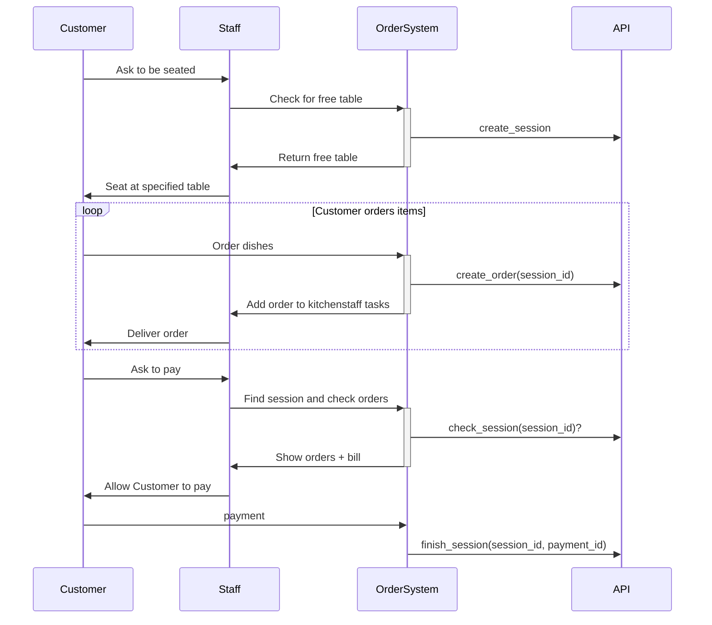

# API Design

Onderstaand wordt een standaard flow voor de Restaurant APP weergeven.

## Voorbereidingen
Voordat deze app ten volste gebruikt kan worden, moeten de tafels en het personeel worden geregistreerd. 

* Tafels
* Tablets
* Personeel(?)
